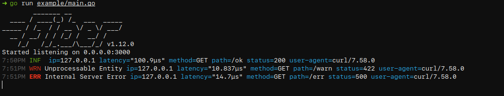

# fiberlog

[](https://pkg.go.dev/github.com/dre1080/fiberlog)

HTTP request/response logger for [Fiber](https://github.com/gofiber/fiber) using [zerolog](https://github.com/rs/zerolog).

### Install

```sh
go get -u github.com/gofiber/fiber
go get -u github.com/dre1080/fiberlog
```

### Usage

```go
package main

import (
  "github.com/gofiber/fiber"
  "github.com/dre1080/fiberlog"
)

func main() {
  app := fiber.New()

  // Default
  app.Use(fiberlog.New())

  // Custom Config
  app.Use(fiberlog.New(fiberlog.Config{
    Logger: &zerolog.New(os.Stdout),
    Next: func(ctx *fiber.Ctx) bool {
      return ctx.Path() != "/private"
    },
  }))

  app.Listen(3000)
}
```

### Example

Run app server:

```sh
$ go run example/main.go
```

Test request:

```sh
$ curl http://localhost:3000/ok
$ curl http://localhost:3000/warn
$ curl http://localhost:3000/err
```


